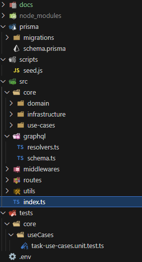
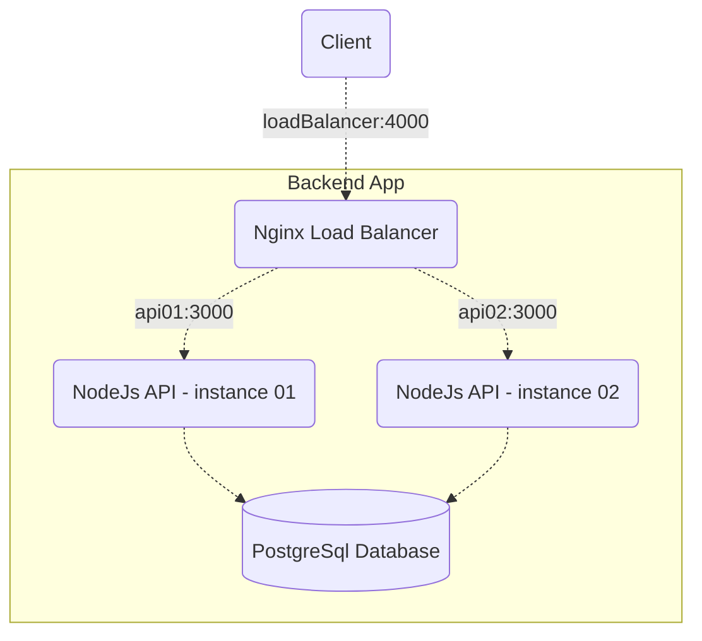
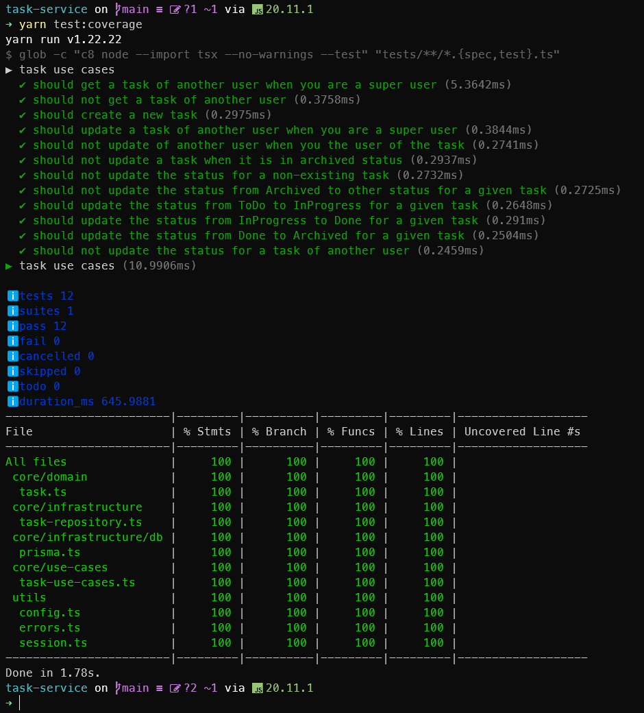
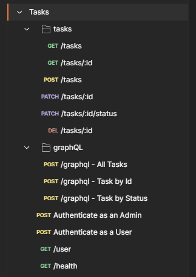

# Task Service

Task Service is a sample application used to handle Tasks by User. The goal here is to show in a simple project how I enjoy designing and implementing the software solutions I have creates after years of experience working as Software Engineer (since 2004) specially with NodeJs. I am always open mind to change it since there is no silver bullet to build software from my perspective.

The base structure of a `Task` is:

```typescript
{
  id: string
  title: string
  description: string
  status: 'todo' | 'inProgress' | 'done' | 'archived'
  createdAt: Date
  userId: string
}
```

The REST API / GraphQL API is protected by user authentication using a `bearer` token (JWT). Before consuming it, you must first authenticate using the `POST /api/v1/auth` endpoint passing the user credentials and a token will be generated. Use it on the `authorization` http request header attribute. Use POSTMAN collection available on the docs folder.

⚠️ **Important**: In this project, there are two types of user. A `super` user that can handle all the tasks and a `non-super` user which can only handle its own tasks. You may get some `401` or `403` errors if a `non-super` user tried to acccess not allowed tasks.

Here is a structure of a `User`:

```typescript
{
  id: string
  name: string
  username: string
  password: string
  email: string
  createdAt: Date
  super: boolean
}
```

## 💻 Stack

The following list represents the main stack and its dependencies:

- NodeJs 20
- Node Test Runner
- Typescript 5.x
- Express
- PostgreSQL database
- Prisma ORM
- Apollo Server (`apollo-server-express`)
- eslint
- jsonwebtoken
- pino (logging)

## 🥇 Architecture

The design was made on the top of `Clean Architecture`, where there are well-separated layers for `Domain` which holds all the abstractions for the domain of the application (Tasks and Users), `Infrastructure` (I/O bound operations) and `UseCases` (business rules). The components of each layer depends on the abstractions of the domain which allows us to inject any derived instance for the abstractions and mock at unit testing level.



## ☁️ Scalability

To emulate the scalability, you can run it on your machine:

```
docker-compose -f docker-compose-test.yml up -d
```

It will up database, two instances of the container app and a `nginx` as a load balancer which will distribute the requests across the containers emulating a situation where we have more than a single instance running for the application. The image for the container app is ready and published on docker hub, you can check it here: https://hub.docker.com/r/felipeoriani/tasks-api-nodejs-typescript



You also can see how the image was build at `Dockerfile`.

But from this repository you will need to run:

```
yarn prisma:reset
```

To migrate and seed the database. Then you can load the postman collection available on the `docs` folder and use it.

Once it is up, the endpoint to consume the api via load balancer is: `http://localhost:4000`.

Finally when you are done, just destroy the environment:

```
docker compose -f docker-compose-test.yml down
```

## ✔️ Tests

It uses the native Node Test Runner as tooling for testing. The tests covers the use cases layer mocks are created using objects and injected on the useCases, specially the `TaskUseCases`.



## 📊 CI/CD

There is a initial workflow on the `./github/workflows` folder that run a few steps to check the project source code including lint, typescript, build (transpilation process of typescript) and tests.

You can see the workflow results at `Actions` tab here: https://github.com/felipeoriani/task-service/actions

## 📓 Improvements

There are space for improvements in this project considering coding, architecture, deployment, automation:

- Implement integration tests to cover the infrastructure layer and api layer;
- Custom error messages for schema validators, maybe considering globalization;
- Implement hashing strategy for user password (security issue);
- Standardize the http response messages using the Problem Details;
- GraphQL configurations, it was my first time dealing with it, I would investigate how to implement the `Mutation` and maybe consider it just a GraphQL API instead of a Mix of REST and GraphQL;
- Improve the test coverage, currently using the `c8` package since node test runner is not able yet (hope in node 22 it will);
- Improve the route configuration on the API level with the express framework;
- Configure CORS properly;
- Configure Rate limiting on the API / Cloud service infrastructure;
- Move environment variables to AWS Secrets Manager and adapt the application to read from there;
- Deploy at AWS ECS (Fargate - serverless) and configure the Task Definitions properly to run and scale the container;
- Use AWS RDS (Aurora) to run the PostgreSQL database;
- Use AWS Elasticache (Redis) to implement some caching strategy;
- Use IaC tool (Terraform or AWS Cloud Formation) to provision the infrastructure and automate it for dev/staging/prod;
- Improve the CI/CD workflows with Github Actions to deploy it into a Cloud Service (currently just doing the basics with CI).

## Endpoints



<table>
    <tr>
        <th>Method</th>
        <th>Endpoint</th>
        <th>Description</th>
        <th>Status</th>
    </tr>
    <tr>
        <td>GET</td>
        <td>/</td>
        <td>Base endpoint</td>
        <td>200 - OK</td>
    </tr>
    <tr>
        <td>GET</td>
        <td>/health</td>
        <td>Healthcheck for the API returning which can be configured on a container orchestration tool.</td>
        <td>200 - OK</td>
    </tr>
    <tr>
        <th colspan=4>GraphQL</th>
    </tr>
    <tr>
        <td>POST</td>
        <td>/api/v1/graphql</td>
        <td>Endpoint to get tasks using Apollo Server. You can read all the tasks, a single task by the id or all the tasks filtered by status.</td>
        <td>200 - OK<br />401 - Unauthorized</td>
    </tr>
    <tr>
        <th colspan=4>User</th>
    </tr>
    <tr>
        <td>POST</td>
        <td>/api/v1/auth</td>
        <td>Authenticate a user using credentials and database users.</td>
        <td>200 - OK<br />404 - Not Found</td>
    </tr>
    <tr>
        <th colspan=4>Tasks</th>
    </tr>
    <tr>
        <td>GET</td>
        <td>/api/v1/tasks</td>
        <td>Returns all the tasks for the authenticated user. In case it's a super user request, return all the tasks.</td>
        <td>200 - OK</td>
    </tr>
    <tr>
        <td>GET</td>
        <td>/api/v1/tasks/:id</td>
        <td>Return a specific task by the given id and authenticated user. In case it's a super user, ignore the authenticated user.</td>
        <td>200 - OK<br />404 - Not Found</td>
    </tr>
    <tr>
        <td>POST</td>
        <td>/api/v1/tasks</td>
        <td>Save a new task for the authenticated user considering a valid request body.</td>
        <td>201 - Created<br />400 - Bad Request<br />422 - Unprocessable Entity</td>
    </tr>
    <tr>
        <td>PATCH</td>
        <td>/api/v1/tasks/:id</td>
        <td>Partially update an existing task for the authenticated user considering a valid request body. Only the title and description.</td>
        <td>200 - OK<br />400 - Bad Request<br />422 - Unprocessable Entity</td>
    </tr>
    <tr>
        <td>PATCH</td>
        <td>/api/v1/tasks/:id/status</td>
        <td>Change the status of a given task for the authenticated user considering a valid request body.<br/> A task can be moved to any status but once it is in the Archive status, it can't be moved anymore.</td>
        <td>200 - OK<br />400 - Bad Request<br />422 - Unprocessable Entity</td>
    </tr>
    <tr>
        <td>DELETE</td>
        <td>/api/v1/tasks/:id</td>
        <td>Delete a task by the given id for the authenticated user.<br/> It's a hard delete, the data will be lost once it succeed.</td>
        <td>204 - No Content<br />400 - Bad Request<br />404 - Not Found</td>
    </tr>
</table>
